# Prompted Segmentation for Drywall QA — Final Report

## 1. Problem Statement

The goal is to train text-conditioned segmentation models that take a 640x640 image and a prompt, and produce a binary mask (values {0, 255}) for the specified defect or region.

Two prompts are supported:
- **"segment crack"** (prompt ID = 0) — thin, low-contrast fractures in drywall/concrete surfaces
- **"segment taping area"** (prompt ID = 1) — larger drywall joint/tape regions

**Key assumption:** The prompt vocabulary is **closed and known a priori** — only the two prompts above are supported. Because the set of segmentation tasks is fixed, we use integer prompt IDs (0 = crack, 1 = taping area) fed into a learned embedding, rather than a full NLP/text-encoder pipeline. No tokenization or language model is involved. This simplification is valid because the prompts are not user-generated or dynamic — they are predetermined by the QA application.

## 2. Dataset

| Dataset | Train | Valid | Test | Source |
|---------|-------|-------|------|--------|
| Drywall-Join | 481 | 202 | — | Roboflow (CC BY 4.0) |
| Cracks | 907 | 201 | 4 | Roboflow (CC BY 4.0) |
| **Merged** | **1,388** | **403** | **4** | — |

**Format:** COCO JSON with segmentation polygons, converted to binary masks via preprocessing pipeline. All images resized to 640x640.

**Known issues:**
- 2 drywall train images have no annotations (included as negative samples)
- 2 potential train/valid leakage pairs identified in drywall dataset (not removed — borderline cases with different crops)
- Cracks dataset: 1 cross-split leakage between train/valid (base name `525_jpg`) and 1 between train/test (base name `2056_jpg`) — not removed, borderline cases with different augmentation crops from Roboflow

## 3. Data Cleaning

All cleaning operations were applied to **train splits only** — validation and test splits were never modified.

**Deduplication:**
- **Drywall:** Annotation-first dedup using bbox matching + SSIM verification → 339 duplicates removed (820 → 481)
- **Cracks:** Base-name + Union-Find grouping to identify Roboflow augmentation variants → 4,257 augmented copies removed (5,164 → 907)

**Quality Assurance:**
Two passes of automated QA were run via `mask_quality_checks.py` (14-point check suite covering tiny annotations, mask bleed, disconnected components, degenerate polygons, empty/all-white masks, and format consistency). The first pass was run after deduplication and corrupt file removal; a second pass verified the cleaned dataset. Minor issues such as mask bleed were flagged but did not warrant removal. Results documented in `reports/mask_quality_report.txt` and `reports/mask_quality_report_2.txt`.

**Visual samples:**

**Duplicate detection — Drywall (SSIM-based):**

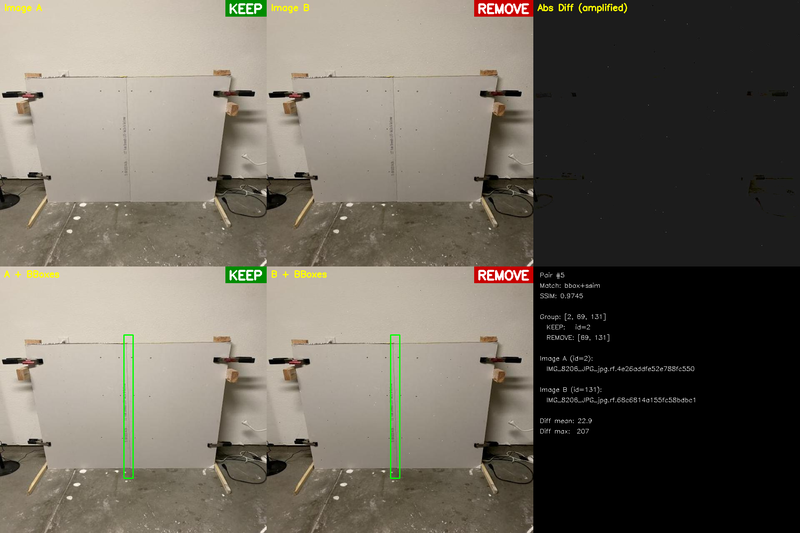

**Duplicate detection — Cracks (base-name grouping):**

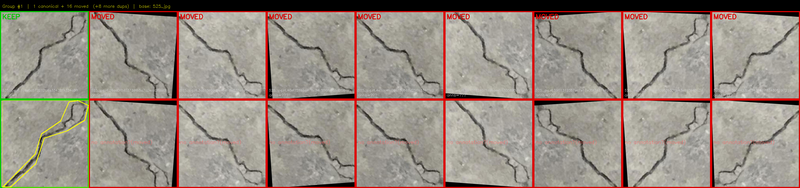

**Tiny annotation detection:**

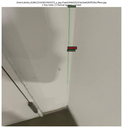

## 4. Methodology

### 4.1 FiLM Conditioning

All models use Feature-wise Linear Modulation (FiLM) to condition segmentation on the prompt. The prompt embedding is injected at every encoder scale plus an auxiliary injection at the decoder bottleneck.

```
Prompt ID ──→ PromptEncoder ──→ prompt_embed (B, 128)
               nn.Embedding(2,128)     |
                                       |──────────────────────────────────┐
                                       |                                  |
Image (B,3,640,640)                    |                                  |
    |                                  |                                  |
    v                                  |                                  |
┌─────────────────┐                    |                                  |
|  SMP Encoder     |                   |                                  |
|  (ResNet-34)     |                   |                                  |
└─────────────────┘                    |                                  |
    |                                  |                                  |
    |── features[0] (64ch) ──────────────────────────────────────┐       |
    |   [no FiLM — raw input]                                    |       |
    |                                                            |       |
    |── features[1] (64ch)  ──→ FiLMBlock_1(γ·f+β) ──────────┐  |       |
    |                                                         |  |       |
    |── features[2] (128ch) ──→ FiLMBlock_2(γ·f+β) ────────┐ |  |       |
    |                                                       | |  |       |
    |── features[3] (256ch) ──→ FiLMBlock_3(γ·f+β) ──────┐ | |  |       |
    |                                                     | | |  |       |
    └── features[4] (512ch) ──→ FiLMBlock_4(γ·f+β) ──┐   | | |  |       |
                                                      |   | | |  |       |
              Auxiliary Injection <────────────────────|───|─|─|──|───────┘
              Linear(128→512)+ReLU                    |   | | |  |
                        |                             |   | | |  |
                        └──────────→ (+) ─────────────┘   | | |  |
                                      |                   | | |  |
                              ┌───────┴───────────────────┴─┴─┴──┘
                              |  modulated features [0..4]
                              v
                     ┌─────────────────┐
                     |   SMP Decoder    |
                     | (skip connects)  |
                     └─────────────────┘
                              |
                              v
                     ┌─────────────────┐
                     | Segmentation    |
                     | Head            |
                     └─────────────────┘
                              |
                              v
                     Output (B, 1, 640, 640)
```

Each **FiLMBlock** learns a per-channel scale (γ) and shift (β) from the prompt embedding:
- `γ = Linear(128 → C)` applied as channel-wise multiplication
- `β = Linear(128 → C)` applied as channel-wise addition
- Result: `γ * feature + β` (broadcast over spatial dims)

The **auxiliary injection** adds a separate projection of the prompt embedding directly to the deepest encoder features, providing an additional conditioning signal at the bottleneck.

### 4.2 Model Architectures

| Model | Framework | Encoder | Parameters |
|-------|-----------|---------|------------|
| U-Net | SMP | ResNet-34 (ImageNet) | 24,766,865 |
| U-Net++ | SMP | ResNet-34 (ImageNet) | 26,409,105 |
| SegFormer B2 | HuggingFace | MiT-B2 (ADE20K finetuned) | 27,677,889 |

SegFormer is initialized from ADE20K-finetuned weights (`nvidia/segformer-b2-finetuned-ade-512-512`); SMP models use ImageNet pretrained encoders. All architectures are wrapped with `FiLMConditionedModel` (or equivalent SegFormer integration) for prompt conditioning.

### 4.3 Augmentation

All experiments use the `full` augmentation tier:

| Transform | Parameters |
|-----------|------------|
| HorizontalFlip | p=0.5 |
| VerticalFlip | p=0.25 |
| Rotate | limit=30, p=0.5 |
| ShiftScaleRotate | shift=0.1, scale=0.15, rotate_limit=0, p=0.5 |
| RandomBrightnessContrast | brightness=0.2, contrast=0.2, p=0.5 |
| CLAHE | clip_limit=4.0, p=0.3 |
| GaussNoise | p=0.2 |
| HueSaturationValue | p=0.3 |
| Sharpen | alpha=(0.2, 0.5), lightness=(0.5, 1.0), p=0.3 |
| ImageNet Normalize | mean=[0.485,0.456,0.406], std=[0.229,0.224,0.225] |

## 5. Training Setup

| Parameter | Value |
|-----------|-------|
| Image size | 640 x 640 |
| Optimizer | AdamW |
| Weight decay | 1e-4 |
| Scheduler | CosineAnnealingLR |
| Epochs | 50 |
| Early stopping | patience=10 (on val Dice) |
| Seed | 24 |

**Learning rates:**
- U-Net / U-Net++: 1e-4
- SegFormer B2: 6e-5

**Batch sizes:**
- U-Net: 32
- U-Net++: 12
- SegFormer B2: 8

**Loss configurations:**
- **Runs 1-3 (Dice+BCE):** 0.5 * DiceLoss + 0.5 * BCEWithLogitsLoss
- **Runs 4-6 (Dice+Focal):** 0.5 * DiceLoss + 0.5 * FocalLoss (α=0.75, γ=2.0)

## 6. Results

### 6.1 Validation Metrics — All 6 Baselines

| # | Model | Loss | Dice | mIoU | Precision | Recall |
|---|-------|------|------|------|-----------|--------|
| 1 | U-Net | Dice+BCE | 0.7670 | 0.6520 | 0.7872 | 0.8112 |
| 2 | U-Net++ | Dice+BCE | 0.7705 | 0.6556 | 0.7975 | 0.8048 |
| 3 | SegFormer B2 | Dice+BCE | 0.7939 | 0.6812 | 0.8087 | 0.8350 |
| 4 | U-Net | Dice+Focal | 0.7760 | 0.6594 | 0.7749 | 0.8352 |
| 5 | U-Net++ | Dice+Focal | 0.7755 | 0.6563 | 0.7815 | 0.8304 |
| 6 | **SegFormer B2** | **Dice+Focal** | **0.8041** | **0.6921** | **0.8092** | **0.8523** |

**Observations:**
- SegFormer B2 outperforms both CNN architectures across all metrics
- Dice+Focal provides a consistent improvement over Dice+BCE for all architectures (+0.5-1.1pp Dice)
- Focal loss improves recall (+1-3pp) with minimal precision trade-off, consistent with its design for hard example mining

**Note on checkpoint selection:** During training, validation Dice was tracked with micro-averaged F1 for dice+BCE experiments. The final evaluation recomputes all metrics with macro-averaged F1, which yields lower Dice values. The checkpoint was selected based on the training metric; all reported numbers above are from the standardized evaluator.

### 6.2 Per-Prompt Metrics

| # | Model | Loss | Crack Dice | Crack IoU | Taping Dice | Taping IoU |
|---|-------|------|------------|-----------|-------------|------------|
| 1 | U-Net | Dice+BCE | 0.6778 | 0.5356 | 0.8557 | 0.7678 |
| 2 | U-Net++ | Dice+BCE | 0.6895 | 0.5497 | 0.8511 | 0.7610 |
| 3 | SegFormer B2 | Dice+BCE | 0.7174 | 0.5775 | 0.8699 | 0.7843 |
| 4 | U-Net | Dice+Focal | 0.6988 | 0.5584 | 0.8528 | 0.7599 |
| 5 | U-Net++ | Dice+Focal | 0.7073 | 0.5672 | 0.8433 | 0.7449 |
| 6 | **SegFormer B2** | **Dice+Focal** | **0.7334** | **0.5950** | **0.8744** | **0.7888** |

There is a consistent ~18-20pp IoU gap between taping and crack segmentation across all models. Taping areas are large, well-defined regions while cracks are thin, variable-width structures that are inherently harder to segment.

### 6.3 Model Footprint & Runtime

| Model | Parameters | Checkpoint | Inference (ms/img) | GPU Peak (MB) |
|-------|------------|------------|-------------------|---------------|
| U-Net (ResNet-34) | 24,766,865 | 284 MB | 17.84 | 8,142 |
| U-Net++ (ResNet-34) | 26,409,105 | 303 MB | 34.11 | 5,895 |
| SegFormer B2 (MiT-B2) | 27,677,889 | 318 MB | 55.94 | 6,086 |

U-Net has the fastest inference (17.84 ms) but highest GPU memory peak. SegFormer is slowest at inference but achieves the best accuracy. U-Net++ offers a middle ground.

### 6.4 Classical CV Baselines

For context, 6 classical computer vision methods were evaluated on 50 samples from each dataset:

| Method | Cracks IoU | Cracks Dice | Drywall IoU | Drywall Dice |
|--------|-----------|-------------|-------------|--------------|
| Gabor filters | 0.2448 | 0.3734 | 0.0255 | 0.0468 |
| Canny + morphology | 0.1414 | 0.2287 | 0.0236 | 0.0452 |
| Otsu threshold | 0.1155 | 0.1896 | 0.0392 | 0.0695 |
| Hough lines | 0.1092 | 0.1777 | 0.0610 | 0.1127 |
| Adaptive threshold | 0.1098 | 0.1870 | 0.0359 | 0.0690 |
| Frangi filters | 0.0748 | 0.1355 | 0.0092 | 0.0181 |

**Best classical:** Gabor filters on cracks (IoU 0.2448), Hough lines on drywall (IoU 0.0610)

**Deep learning improvement over best classical:**
- Cracks: 0.5950 / 0.2448 = **2.4x** IoU improvement
- Drywall: 0.7888 / 0.0610 = **12.9x** IoU improvement

Classical methods completely fail on drywall joint segmentation, which requires understanding of spatial context that only learned features can capture.

### 6.5 Feature Channel Analysis

We also evaluated whether classical CV preprocessing (edge/texture filters) could serve as additional input channels to boost segmentation. Five feature extractors were scored using **Fisher's linear discriminant** (higher = better foreground/background separability):

| Feature Channel | Cracks FLD | Drywall FLD | Time (ms) |
|-----------------|-----------|-------------|-----------|
| Multiscale LoG | 1.466 | 0.096 | 30.0 |
| Gabor filters | 0.967 | 0.045 | 84.5 |
| Sobel edges | 0.422 | 0.019 | 3.7 |
| Laplacian | 0.359 | 0.023 | 4.0 |
| Frangi filters | 0.138 | 0.007 | 1272.8 |

On cracks, Multiscale LoG and Gabor show moderate discriminative power — these could potentially be concatenated as extra input channels. On drywall, all features have near-zero FLD, confirming that low-level filters cannot distinguish taping areas from background. Due to time constraints, integrating these as additional input channels was not attempted in the current experiments.

### 6.6 Training Curves

All models converge within 30-40 epochs, with SegFormer showing smoother loss curves. Val Dice shows steady improvement with SegFormer reaching peak around epoch 46-48. Val mIoU tracks Dice closely; SegFormer achieves consistent lead from epoch ~15 onward.

| Train Loss | Val Dice | Val mIoU |
|:---:|:---:|:---:|
| 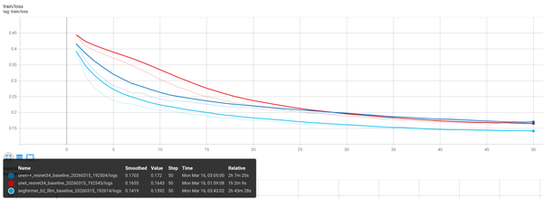 | 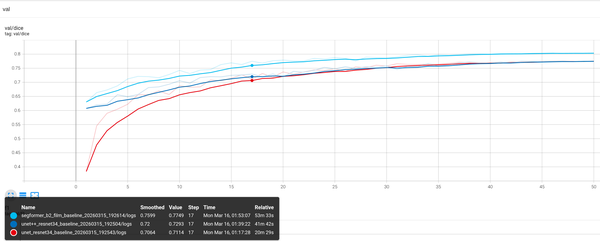 | 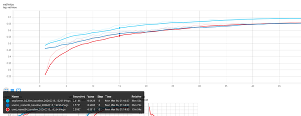 |

## 7. Visual Examples

4-panel format per sample: Input | Input+Pred (green) | Input+GT (red) | Combined (R=GT, G=Pred, Y=Both)

### Best Predictions — SegFormer B2 (Dice+Focal)

Top 5 crack and top 5 taping predictions sorted by IoU (best first):

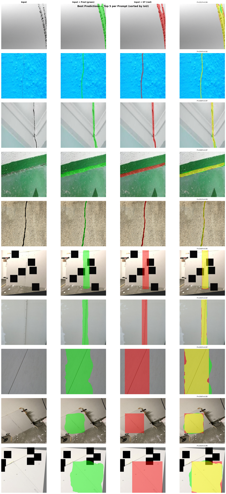

### Failure Analysis — SegFormer B2 (Dice+Focal)

The top 50 worst predictions (sorted by IoU) were analyzed in detail. Per-sample metrics are available in `failure_analysis/per_sample_metrics.csv`.

**Key observations from top 50 failures:**
- 46 out of 50 worst samples are **cracks**, only 4 are taping — confirming crack segmentation is the harder task
- There is **no consistent pattern** of under-segmentation or over-segmentation. Some crack failures show precision near 1.0 (model predicts a strict subset of GT), while others show recall near 1.0 (model predicts a superset of GT). This suggests the errors are driven by noise in the crack ground truth annotations rather than a systematic model bias
- 1 taping sample (idx 211) has **no ground truth annotation** at all (gt_coverage = 0%), resulting in IoU = 0

**Top 50 worst predictions (5 grids of 10 each):**

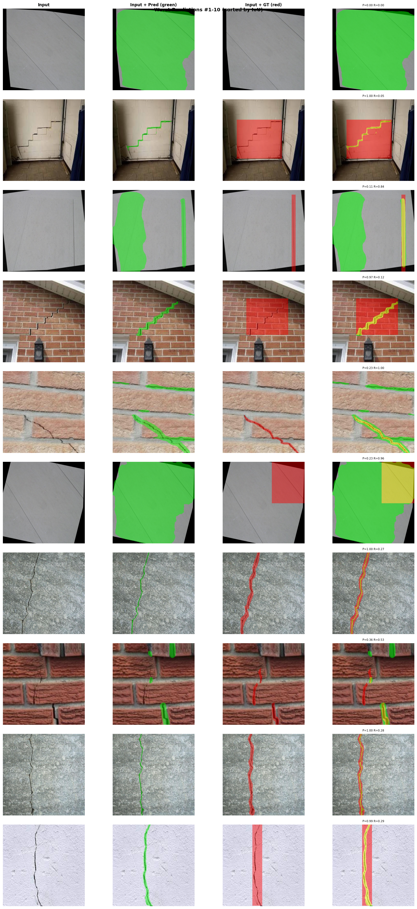

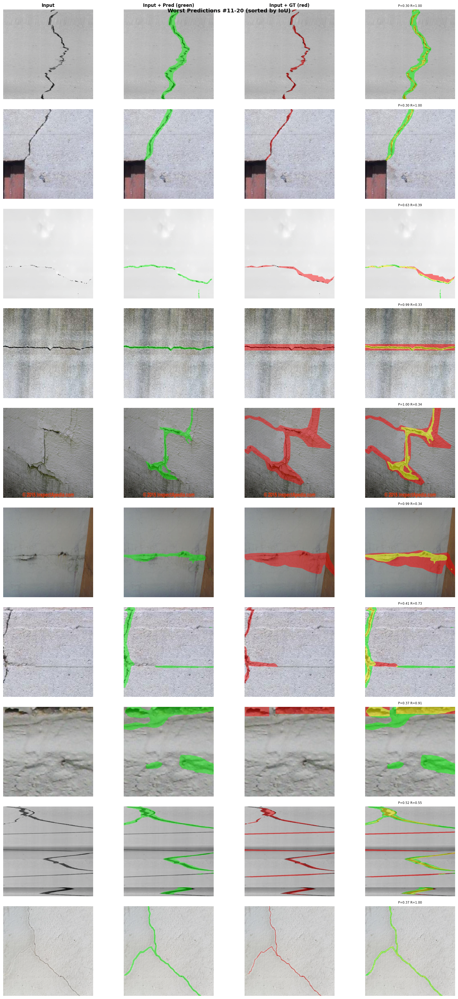

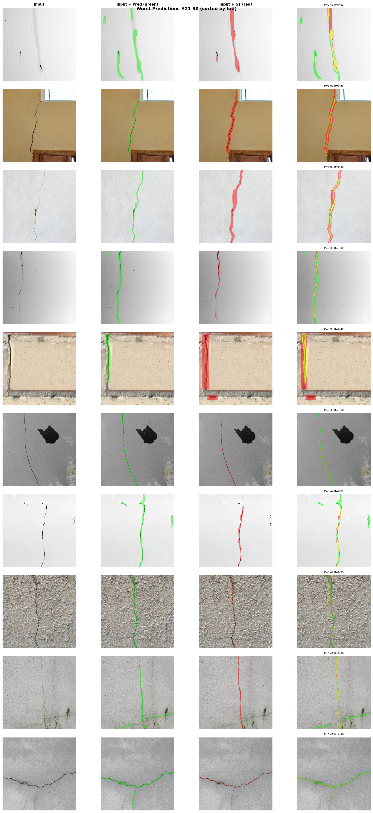

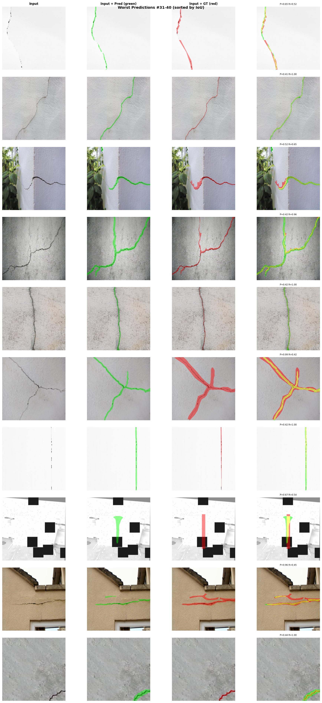

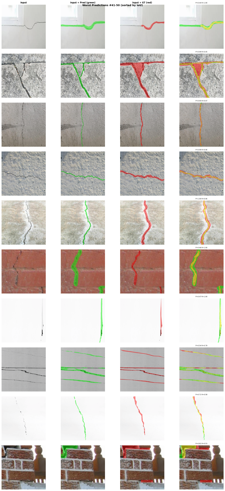

### Per-Experiment Reports

Detailed per-class metrics and runtime reports for each experiment are in `reports/`. Per-sample metrics CSVs (sortable by IoU/Dice per image) are in each experiment's `failure_analysis/per_sample_metrics.csv`.

## 8. Future Experiments

Based on the failure analysis and feature channel evaluation, the following directions are planned:

- **Higher resolution input** — Training at 640x640 may lose fine crack detail; experimenting with larger input sizes could improve thin-crack segmentation
- **Classical CV features as additional input channels** — Multiscale LoG and Gabor filters showed moderate discriminative power for cracks (FLD 1.47 and 0.97). Concatenating these as extra input channels alongside RGB could improve crack detection without adding learnable parameters
- **Boundary loss and crack width augmentation** — Dice+Focal+Boundary loss with CrackWidthAugmentation to address thin-crack under-segmentation (see [Additional Experiments](additional_experiments.md))
- Explore Classical CV post processing techniques.

## 9. Supplementary Work

Detailed documentation of classical CV evaluation, visualization tooling, failure analysis methodology, and data preprocessing pipeline is available in [Supplementary Work](supplementary_work.md).
